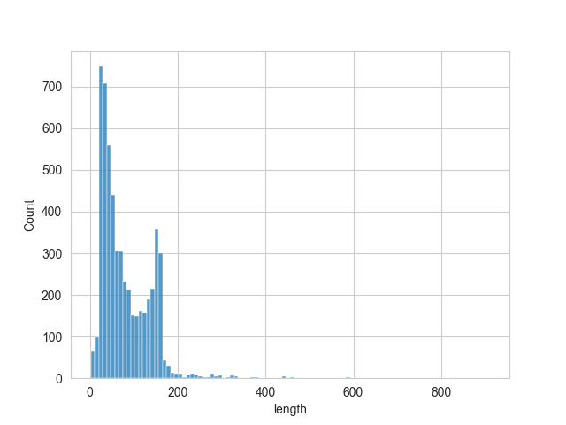
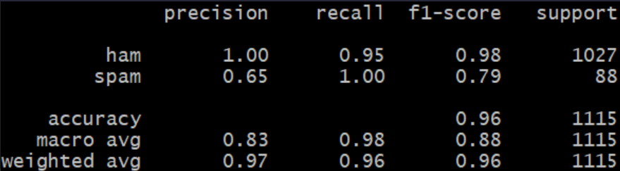

# Natural Language Processor: Spam Filter

## Description

In this project I used NLP to filter if messages were spam or not. The technologies used were:

- python 
- sklearn
- panda
- nltk
- seaborn
- matplotlib

The main challenge faced during this challenge was learning how to create pipelines.

## Installation

To install this project you will have to download the repository from github and runit locally from your CLI. To be able to use this project python will have to be installed, which can be found [here](https://www.python.org/downloads/).

## Usage

Once installed you can use this project by entering the repository location using your CLI. Once entered into the repository you can run the project by first entering ```source .venv/Scripts/activate``` and then entering ```python NLP_1.py``` in the CLI.

Once run a graph will show up as well as a classification report as shown here:



