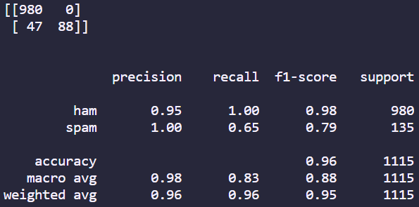

# Natural Language Processing: Spam Filter

## Description

In this project I used NLP to filter if messages were spam or not. The technologies used were:

- python 
- sklearn
- pandas
- nltk
- seaborn
- matplotlib

I did the same methodology to filter spam in both files except one of them I used pipeline which made the code more succint. The main challenge faced during this challenge was learning how to create pipelines.

## Installation

To install this project you will have to download the repository from github and runit locally from your CLI. To be able to use this project python will have to be installed, which can be found [here](https://www.python.org/downloads/).

## Usage

Once installed you can use this project by entering the repository location using your CLI. Once entered into the repository you can run the project by entering the following in the CLI:

1. Creating a virtual environment: ```python -m venv .venv```
2. Activating the virtual environment: ```source .venv/Scripts/activate```
3. Downloading all the required packages: ```pip install -r requirements.txt```
4. Running the file: ```python NLP_NoPipeline.py``` or ```python NLP_Pipeline.py```

Once run a graph will show up as well as a confusion matrix and classification report as shown here:



